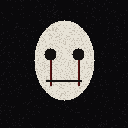

# The Knocker 🚪👁️

A psychological horror creature for **Minecraft Bedrock Edition**.

> A pale-faced figure in a black robe. He doesn't smash through your walls in a
> blind rage — he *knocks*. Sometimes he leaves. Sometimes he doesn't.



## Appearance
- **White / pale visible face** with hollow eyes, a blood streak, and a long mouth.
- **Black robe-like body** (head reads as a hood, only the face shows).
- Holds an **iron axe** by default and switches to an **iron pickaxe** when it has
  to mine through stone.

## What it does

| Behaviour | Detail |
|---|---|
| 🚪 **Knocks on doors** | When it reaches a door with a player nearby it knocks 3 times. |
| 🎲 **60% leaves / 40% breaks in** | After knocking it rolls: 60% it walks away, 40% it chops the door down and enters. |
| 😱 **Stare → scream → chase** | Once inside, when you are within **5 blocks** it turns to face you, plays a **very loud scream**, goes hostile and chases. |
| 🔥 **Arson** | If a player is within ~8 blocks **and not looking at it**, it sets nearby flammable blocks on fire. Stops the moment you look. |
| 🧱 **Player-like mining** | When hostile it breaks blocks in its way **on a cooldown** (it doesn't insta-break). Wood/most blocks → **iron axe**, stone-type → **iron pickaxe**. So barricading a door with stone just makes it pull out the pickaxe. |
| 🐛 **Crawling** | Can drop to the floor and crawl (smaller hitbox, crawl animation). |
| 🛡️ **Fire-immune** | It is immune to the fires it sets. |

## Install
1. Double-click **`TheKnocker.mcaddon`** — Minecraft imports both packs automatically.
2. In a world: **Settings → enable the Behavior Pack** (the Resource Pack is auto-added).
3. Enable **Beta APIs / Scripting** isn't required for stable script modules, but make
   sure the world has **cheats on** if you want to use the `/scriptevent` test commands.

## Testing — `/scriptevent` commands
Run these in chat (cheats enabled). Everything targets the **nearest Knocker** to you,
spawning one if needed.

```
/scriptevent knocker:help          Show this list in-game
/scriptevent knocker:spawn         Spawn a Knocker in front of you
/scriptevent knocker:knock         Move nearest Knocker to your door and knock (60/40)
/scriptevent knocker:break_door    Force the break-in branch on a nearby door
/scriptevent knocker:scream        Force the stare + loud scream + chase
/scriptevent knocker:chase         Make it hostile and hunt you right now
/scriptevent knocker:burn          Force the arson behaviour nearby
/scriptevent knocker:mine          Make it mine the block in front of it (axe/pickaxe auto)
/scriptevent knocker:crawl         Make it crawl
/scriptevent knocker:stand         Make it stand back up
/scriptevent knocker:axe           Force the iron axe
/scriptevent knocker:pickaxe       Force the iron pickaxe
/scriptevent knocker:passive       Calm it down (stops chasing)
/scriptevent knocker:remove        Remove all Knockers
```

You can also use the **spawn egg** ("The Knocker") in the creative inventory, or
`/summon knocker:the_knocker`.

## How it works
- **`TheKnocker_BP`** – behavior pack: the entity definition + a `@minecraft/server`
  script (`scripts/main.js`) that runs all the psychological AI and the test commands.
- **`TheKnocker_RP`** – resource pack: custom humanoid model with a held-item locator,
  the pale-faced texture, walk/idle/crawl animations, and an animation controller.

The heavy behaviour (door logic, probability, line-of-sight arson, cooldown mining,
tool swapping) lives in the script so it can be tuned in one place — see the
`Tunables` block at the top of `scripts/main.js`.

## Tuning
Open `TheKnocker_BP/scripts/main.js` and edit the constants near the top:
`BREAK_COOLDOWN`, `BURN_RANGE`, `BURN_COOLDOWN`, `SCREAM_RANGE`, the `0.6` knock roll, etc.
