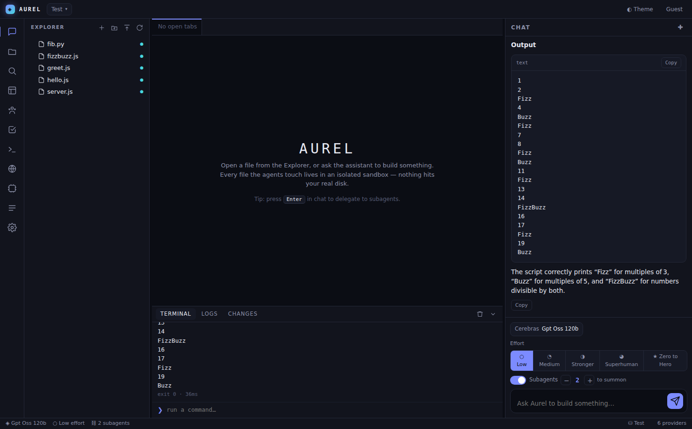

# Aurel — Multi-Agent AI Coding Assistant

Aurel is a Cursor-style coding workspace backed by a **true multi-agent
architecture**, an **isolated sandbox**, and **live model switching across every
provider whose API key is present in the environment**. The lead agent plans a
request, delegates it to specialized subagents that run in parallel, lets the
"actor" agents create and run real files inside a sandbox, then merges everything
into one streamed answer.

It is a real full-stack application — **not** a static mockup. The backend holds
the provider keys and calls the models; the browser talks only to the backend.



---

## Highlights

- **9 specialized subagents** — Planner, Coding, Debugging, Review, Documentation,
  Terminal, File Management, Research (web-browsing), Testing. The lead agent routes
  work to the most relevant ones and runs them concurrently.
- **Live model switcher** — every model from every configured provider, grouped by
  provider, searchable, switchable at runtime with no restart. In this environment
  that is **500+ models** across Groq, Cerebras, Mistral, OpenRouter, Google Gemini
  and Cohere.
- **Five effort levels** — `Low · Medium · Stronger · Superhuman · Zero to Hero`.
  Effort changes planning depth, parallelism, retries, validation and review passes,
  temperature and the depth of reasoning — immediately.
- **Subagent switch** — toggle delegation on/off and choose how many subagents (1–6)
  to summon; the count drives routing, parallel execution and synthesis.
- **Isolated sandbox** — per-project on-disk filesystem with create / read / edit /
  delete / rename / move / mkdir / search / replace, an allow-listed command runner
  (stdout, stderr, exit code, execution time), and a full change log.
- **Full workspace** — file explorer with drag-and-drop, upload/download, tabs, split
  editor, syntax highlighting, Markdown/HTML preview, JSON tree, image preview, diff
  viewer, global search & replace, integrated terminal, live logs.
- **Task manager** — every run is a background task with progress, pause, resume and
  (real) cancel.
- **Memory** — conversation history, project memory, file summaries, task history and
  agent context, per project.
- **Accounts** — local sign-up / sign-in (scrypt-hashed) or continue as guest.
- **Dark & light themes**, keyboard shortcuts, settings across General / Capability /
  Tools / Extras.

---

## Quick start

```bash
npm install
# Provide at least one provider key (see .env.example). In a managed environment
# these are already exported. Otherwise:
cp .env.example .env   # then fill in the keys you have
npm start
# open http://localhost:4173
```

Providers with a missing or invalid key are simply hidden from the switcher — you
can run Aurel with a single key or all of them.

### Supported providers

| Provider     | Env var              | Adapter          |
|--------------|----------------------|------------------|
| Groq         | `GROQ_API_KEY`       | OpenAI-compatible |
| Cerebras     | `CEREBRAS_API_KEY`   | OpenAI-compatible |
| Mistral      | `MISTRAL_API_KEY`    | OpenAI-compatible |
| OpenRouter   | `OPEN_ROUTER_API_KEY`| OpenAI-compatible |
| Google Gemini| `GEMINI_API_KEY`     | OpenAI-compatible (Gemini's OpenAI surface) |
| Zhipu GLM    | `GLM5.2_API_KEY`     | OpenAI-compatible |
| Cohere       | `COHERE_API_KEY`     | Cohere v2         |

Outbound HTTPS is routed through `HTTPS_PROXY` with `NODE_EXTRA_CA_CERTS` when set
(managed environments), so `fetch` reaches the providers correctly.

---

## Architecture

The project is deliberately modular — frontend, backend, sandbox, agents, providers,
models, services, components and utilities are separated.

```
server/
  index.js            HTTP server: static hosting + JSON/SSE API
  config.js           env loading, proxy transport, provider registry
  providers/          model-provider adapters
    openai.js         OpenAI-compatible streaming adapter
    cohere.js         Cohere v2 streaming adapter
    index.js          unified dispatch
  models/registry.js  fetch + normalize + group + cache models by provider
  agents/
    catalog.js        the 9 subagent definitions + routing hints
    effort.js         the 5 effort profiles
    tools.js          tool protocol (write/read/edit/run/web_* …) + executor
    orchestrator.js   plan → delegate (parallel) → validate → review → synthesize
  sandbox/
    sandbox.js        isolated per-project filesystem + change tracking
    exec.js           allow-listed command execution with timeout & metrics
  services/
    auth.js           accounts & sessions (scrypt)
    workspace.js      projects + memory
    tasks.js          long-running task registry (pause/resume/cancel)
    browse.js         real web fetch + search for the Research Agent
    db.js             tiny JSON persistence
  utils/              logger, cache, ids, http/SSE helpers
web/
  index.html, styles.css
  js/
    app.js            bootstrap, auth, rail, layout, status bar, shortcuts
    store.js          reactive state + persistence
    api.js            REST client + SSE chat stream
    actions.js        shared operations
    chat.js           streaming chat + live agent activity + model controls
    editor.js         tabs, split, code editor, previews, diff
    sidebar.js        explorer (DnD/upload) + global search/replace
    dock.js           terminal, logs, change feed
    views.js          Agents, Tasks, Settings, Browser, Sandbox, Memory
    modelmodal.js     model switcher
    highlight.js      syntax highlighter
    markdown.js       markdown renderer
```

### How a request flows

1. The chat composer posts to `POST /api/chat`, which streams back Server-Sent Events.
2. The **orchestrator** emits a `stage`, optionally runs the **Planner**, then routes
   the request to *N* subagents based on keywords and the plan.
3. Subagents run through a **concurrency pool** (width = effort's parallelism).
   *Actor* agents (Coding, Terminal, File, Debugging, Testing, Documentation, Research)
   drive a **tool loop**: the model emits ```` ```action ```` blocks, the backend
   executes them against the sandbox / web, and feeds observations back.
4. Effort-gated **validation** (Testing Agent) and **review** passes run.
5. The lead agent **synthesizes** a single final answer, streamed token-by-token to the
   chat while file changes, terminal output and agent status stream live to the UI.

Transient failures (HTTP 429 / 5xx) are retried with the provider's suggested delay —
important because parallel subagents share a provider's rate limit.

---

## Security & isolation

- Agents operate **only inside the sandbox** (`data/sandboxes/<project>/files`). Path
  traversal is blocked; the real project tree is never touched.
- The terminal and the `run` tool use a **command allow-list** with a timeout and
  output cap.
- Provider keys stay on the server; the browser never sees them.

---

## Keyboard shortcuts

| Shortcut | Action |
|----------|--------|
| ⌘/Ctrl + K | Model switcher |
| ⌘/Ctrl + S | Save file |
| ⌘/Ctrl + B | Toggle sidebar |
| ⌘/Ctrl + J | Toggle terminal |
| ⌘/Ctrl + \\ | Toggle chat |
| Enter | Send message (configurable) |

---

Built with zero runtime dependencies beyond [`undici`](https://github.com/nodejs/undici)
(for proxy-aware `fetch`). The frontend is dependency-free vanilla ES modules — no build step.
