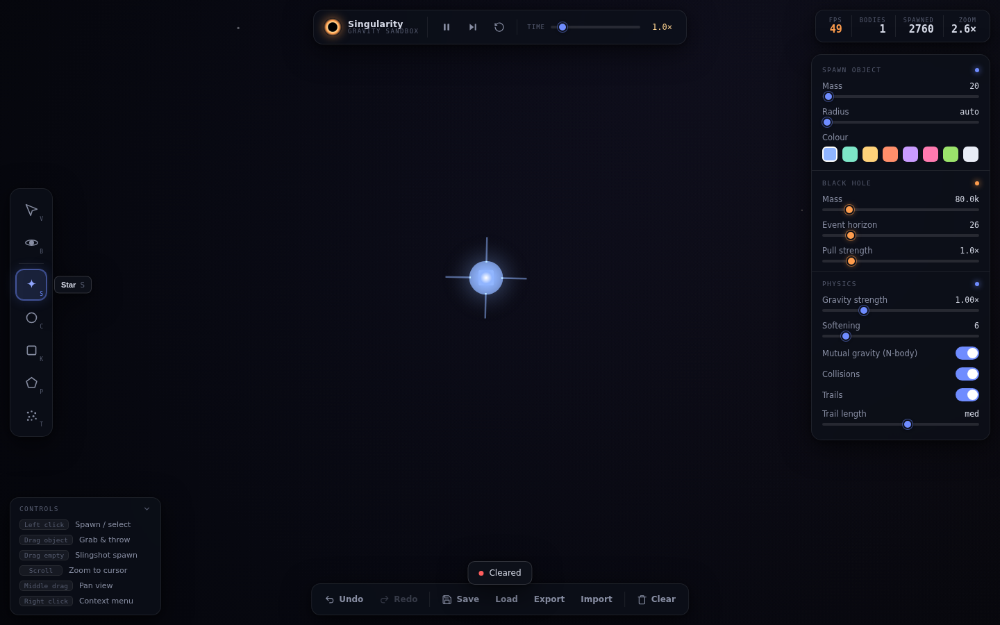

# Singularity — Gravity Sandbox

A polished, self-contained 2D browser physics sandbox focused on **gravity and
black holes**, inspired by Universe Sandbox, Algodoo, and Powder Toy. Everything
runs client-side in a single HTML file — no build step, no dependencies, no
network.

**Open [`index.html`](index.html) in any modern browser** to play.

## Features

**Simulation**
- Real Newtonian **N-body gravity** between all massive objects, accelerated with
  a **Barnes-Hut quadtree** (O(n log n)) so it stays smooth into the thousands.
- **Black holes** with adjustable mass, event-horizon radius, and pull strength.
  They consume anything crossing the horizon, conserve momentum, grow their
  horizon realistically (∝ ∛mass), and **merge** with each other.
- **Fixed-timestep** symplectic integration with gravitational softening for
  stable orbits; the accumulator clamps frame spikes to avoid a death spiral.
- Object types: **circles, blocks, polygons, particles, stars, black holes**.
- Optional **collisions** (impulse resolution via a spatial hash), **mutual
  gravity** toggle (full N-body vs. fast attractor-only mode), and **trails**.
- Explosion / accretion **particle effects**.
- Adjustable **time scale** (0.1×–10×), **pause / resume / single-step**.

**Tools & UI**
- Modern dark "observatory HUD" theme.
- Tool rail, transport bar, live **FPS** + **body/spawn counters**, and a full
  **object inspector** (mass, radius, position, velocity, speed, acceleration,
  momentum, kinetic energy).
- Sliders for gravity, softening, time scale, spawn mass/radius, and all
  black-hole properties.
- **Undo / redo**, **save / load** (browser storage), and **export / import**
  world files (JSON).

## Controls

| Input | Action |
| --- | --- |
| **Left click** | Spawn (current tool) or select |
| **Drag object** | Grab and throw (release to launch) |
| **Drag empty** | Slingshot-spawn with velocity |
| **Scroll wheel** | Zoom to cursor |
| **Middle drag** | Pan the view |
| **Right click** | Context menu (inspect, pin, delete, world actions) |

Keyboard shortcuts are optional conveniences (tool hotkeys, `Space` to pause,
`Ctrl/Cmd+Z` undo) — every feature is reachable by mouse alone.

**Touch:** tap to spawn/select, drag to grab/throw, **pinch to zoom**, two-finger
pan, long-press for the context menu. No virtual joysticks.

## Files

- **`index.html`** — the standalone app (open this).
- **`artifact.html`** — the same content without the outer `<html>`/`<head>`
  wrapper, used to publish the Claude Artifact. `index.html` is generated from it.

## Performance notes

Gravity is the only O(n log n) cost; rendering uses level-of-detail (flat fills
and `fillRect` batching past ~500 bodies, simplified black-hole halos when many
are present) so thousands of bodies stay interactive. The engine was
stress-tested with 1500+ objects, dozens of black holes, coincident bodies,
rapid parameter changes, and long high-speed runs — with no NaN/Infinity blowups.
